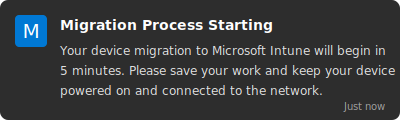
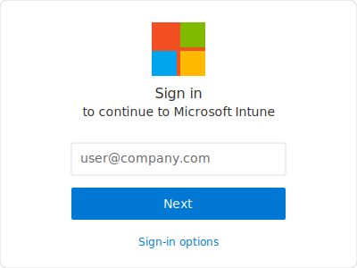

# Workspace ONE to Azure/Intune Migration - End User Guide

## Introduction

This guide will help you understand what to expect during the migration of your device from VMware Workspace ONE to Microsoft Azure/Intune. This migration enhances your device security and management while providing seamless access to Microsoft services.

## What Is Changing?

Your device is transitioning from VMware Workspace ONE management to Microsoft Intune management. This change:

- Improves integration with Microsoft 365 services
- Enhances security features
- Streamlines access to corporate resources
- Enables better remote support options

## Before Migration: Preparation Checklist

Please complete these steps before your scheduled migration date:

- [ ] Save all open work and documents
- [ ] Close all applications
- [ ] Ensure your device is connected to power
- [ ] Connect to a reliable network (corporate network preferred)
- [ ] Verify you have at least 5GB of free disk space
- [ ] Back up any critical personal files to OneDrive or approved storage

## The Migration Experience: What to Expect

### Migration Notification

You'll receive a notification before migration begins:

This notification will include:
- The scheduled migration time
- Estimated duration (typically 30-60 minutes)
- Contact information for support

### During Migration

1. **Initial Notification**: You'll see a message that migration is starting
2. **Lock Screen Updates**: Your lock screen will display migration progress
3. **Multiple Reboots**: Your device will restart several times automatically
4. **Progress Indicators**: Status updates will appear as notifications
5. **Temporary Limited Access**: During migration, some services may be temporarily unavailable

### Migration Stages

The migration proceeds through these stages:

#### Stage 1: Preparation (5-10 minutes)
- You'll receive a notification that migration is starting
- Please save your work and keep your device powered on
- Device will prepare for migration

#### Stage 2: Management Transition (10-15 minutes)
- Workspace ONE components will be removed
- Your device will restart
- Progress will be displayed on the lock screen

#### Stage 3: Azure AD Setup (10-15 minutes)
- Your device will join Microsoft Azure AD
- Microsoft Intune management will be configured
- Another restart may occur

#### Stage 4: Completion (5-10 minutes)
- Final configuration and validation
- You'll receive a notification that migration is complete
- You can then log in and resume normal work

## User Actions During Migration

In most cases, the migration will proceed automatically without requiring your intervention. However, there are a few points where you may need to take action:

### Possible Authentication Request

You may be prompted to sign in with your company credentials:

- Use your standard company email and password
- If Multi-Factor Authentication is enabled, be prepared to complete this step
- Contact support if you have trouble accessing your account

### Completion Notification

When migration is complete, you'll receive a notification:

- Click or tap "Get Started" to proceed
- Your device is now ready for normal use
- All your applications and files should be available

## After Migration: Verifying Success

After migration completes, please verify:

1. You can log in with your company credentials
2. Your corporate applications are available
3. You can access company resources 
4. Your files and data are intact
5. The Microsoft Company Portal app is installed

## Frequently Asked Questions

### How long will the migration take?
The migration typically takes 30-60 minutes, depending on your device specifications and network speed.

### Will I lose any data during migration?
No, your data should remain intact. However, it's always a best practice to back up important files before any system change.

### What if I need to use my device during the scheduled migration time?
Please contact your IT department to reschedule the migration to a more convenient time.

### Will my applications need to be reinstalled?
No, your applications should remain installed and functional after migration.

### How will I know if the migration was successful?
You'll receive a completion notification, and you'll be able to log in normally.

### What is the Microsoft Company Portal app?
This app allows you to:
- Access company applications
- Verify your device compliance status
- Reset your company password
- Contact IT support

## Troubleshooting Common Issues

### Issue: Migration Appears Stuck

If progress seems halted for more than 30 minutes:

1. Check if the screen shows any error messages
2. Wait an additional 15 minutes (some stages take longer)
3. If no progress, contact IT support

### Issue: Cannot Log In After Migration

If you cannot log in after migration completes:

1. Ensure you're using your company email and password
2. Try restarting your device
3. Verify you're connected to the network
4. Contact IT support if login issues persist

### Issue: Missing Applications

If applications are missing after migration:

1. Open the Company Portal app
2. Check for available applications to install
3. Restart your device
4. Contact IT support if applications remain unavailable

### Issue: Error Messages

If you see error notifications:

1. Note the exact error message text
2. Take a screenshot if possible
3. Contact IT support with these details

## Getting Help

If you encounter any issues during or after migration, contact support through:

- **Email**: support@company.com
- **Phone**: 555-123-4567
- **Help Portal**: https://support.company.com
- **Teams**: IT Support Channel

When requesting help, please provide:
- Your device name (found in System settings)
- Your username
- Description of the issue
- Any error messages
- Screenshots if possible

## Post-Migration Benefits

After migration is complete, you'll enjoy several benefits:

- **Single Sign-On**: Simplified access to Microsoft services
- **Enhanced Security**: Better protection for company data
- **Improved Support**: Easier remote assistance from IT
- **Self-Service Portal**: Access to Company Portal for apps and support
- **Simplified Updates**: More reliable software updates

## Feedback

We value your experience and would appreciate your feedback on the migration process:

1. After migration, you may receive a feedback request
2. Please take a moment to share your experience
3. Your input helps us improve the process for others

Thank you for your cooperation during this important upgrade to your device management system! 