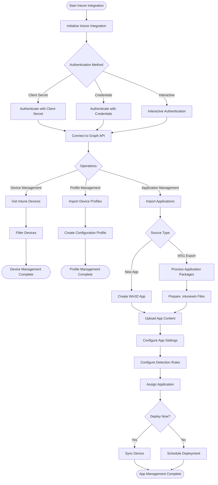

# Intune Integration Documentation

## Overview

The IntuneIntegration module provides comprehensive functionality for interacting with Microsoft Intune via the Graph API for device enrollment, profile management, and application deployment during migration from Workspace ONE.

## Workflow Diagram

The following diagram illustrates the Intune integration workflow:



## Key Features

- Authentication to Microsoft Graph API for Intune operations
- Device management and inventory
- Device configuration profile import and deployment
- Win32 application packaging and deployment
- Application assignment management
- Integration with Microsoft Graph API
- Error handling and logging

## Module Functions

| Function | Description |
|----------|-------------|
| `Initialize-IntuneIntegration` | Initializes the Intune integration module |
| `Get-IntuneDevices` | Retrieves managed device information from Intune |
| `Import-IntuneDeviceConfigurationProfile` | Imports a device configuration profile into Intune |
| `Get-IntuneApplications` | Retrieves applications from Intune |
| `New-IntuneWin32App` | Creates a new Win32 application in Intune |
| `Import-IntuneApplication` | Imports an application into Intune from a migration package |
| `Import-IntuneApplications` | Imports multiple applications into Intune from a migration export |
| `New-IntuneAppAssignment` | Creates an application assignment in Intune |
| `Import-ApplicationAssignments` | Imports application assignments from WS1 to Intune |
| `Sync-DeviceAppInstallStatus` | Synchronizes app installation status on devices |

## Usage Examples

### Initialize Intune Integration

```powershell
# Initialize with client credentials
Initialize-IntuneIntegration -TenantId "00000000-0000-0000-0000-000000000000" `
                            -ClientId "11111111-1111-1111-1111-111111111111" `
                            -ClientSecret $secretValue

# Initialize with user credentials
Initialize-IntuneIntegration -TenantId "00000000-0000-0000-0000-000000000000" `
                            -Credential $credential

# Initialize with interactive login
Initialize-IntuneIntegration -TenantId "00000000-0000-0000-0000-000000000000"
```

### Device Management

```powershell
# Get all Windows devices
Get-IntuneDevices -Filter "contains(operatingSystem, 'Windows')"
```

### Device Configuration Profiles

```powershell
# Import Windows 10 security profile
$settings = @{
    passwordRequired = $true
    passwordBlockSimple = $true
    passwordMinimumLength = 8
    passwordMinutesOfInactivityBeforeScreenTimeout = 15
}

Import-IntuneDeviceConfigurationProfile -ProfileName "Windows10-Security" `
                                      -Description "Security settings for Windows 10 devices" `
                                      -PlatformType "Windows10" `
                                      -Settings $settings
```

### Application Management

```powershell
# Import applications from WS1 export
Import-IntuneApplications -ExportPath "C:\Temp\WS1_Apps" `
                         -IntuneWinAppUtilPath "C:\Tools\IntuneWinAppUtil.exe"

# Create app assignment
New-IntuneAppAssignment -AppId "12345678-1234-1234-1234-123456789012" `
                       -GroupId "87654321-4321-4321-4321-210987654321" `
                       -Intent "required"

# Sync devices to start app installation
Sync-DeviceAppInstallStatus
```

## Error Handling

The IntuneIntegration module includes comprehensive error handling:

- Validates authentication before operations
- Checks for required PowerShell modules
- Implements retry logic for API operations
- Logs detailed information about failures
- Provides validation for successful operations

## Integration with Other Modules

The IntuneIntegration module integrates with:

- **LoggingModule**: For comprehensive logging
- **WorkspaceOneIntegration**: For migration data extraction
- **MigrationEngine**: For coordinating the migration process
- **SecurityFoundation**: For secure credential handling 