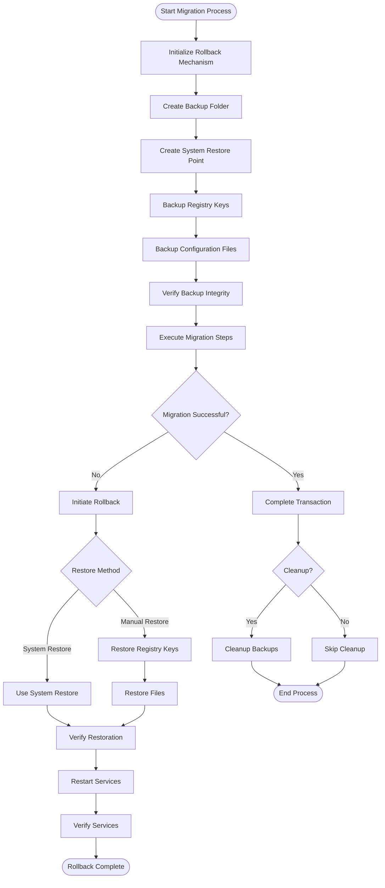

# Rollback Mechanism Documentation

## Overview

The RollbackMechanism module provides comprehensive rollback capability for failed migrations from Workspace ONE to Azure/Intune. This module ensures that devices can be restored to their pre-migration state if any part of the migration process fails.

## Workflow Diagram

The following diagram illustrates the rollback mechanism workflow:



## Key Features

- System restore point creation before migration
- Registry key and file backup and restoration
- Service management during rollback
- Transaction-based operations with automatic rollback
- Step-by-step migration with rollback capability
- Comprehensive backup verification
- Cleanup of old backups

## Module Functions

| Function | Description |
|----------|-------------|
| `Initialize-RollbackMechanism` | Sets up the rollback environment for a migration operation |
| `New-MigrationRestorePoint` | Creates a system restore point before migration |
| `Backup-WorkspaceOneConfiguration` | Creates a backup of Workspace One related registry keys and files |
| `Restore-WorkspaceOneMigration` | Restores system to pre-migration state |
| `Complete-MigrationTransaction` | Completes the migration transaction and cleans up backups |
| `Invoke-MigrationStep` | Executes a migration step with rollback capability |
| `Restore-BackupItems` | Restores items from a backup based on backup ID |
| `Test-RestorationValidity` | Validates that items were correctly restored from backup |

## Usage Examples

### Initialize Rollback Mechanism

```powershell
# Initialize with default settings
$backupFolder = Initialize-RollbackMechanism

# Initialize with custom backup path
$backupFolder = Initialize-RollbackMechanism -BackupPath "C:\MigrationBackups"
```

### Create System Restore Point

```powershell
# Create restore point with default description
New-MigrationRestorePoint

# Create restore point with custom description
New-MigrationRestorePoint -Description "Pre-WS1 to Intune Migration"
```

### Backup Workspace ONE Configuration

```powershell
# Backup with default settings
Backup-WorkspaceOneConfiguration

# Backup to a specific folder
Backup-WorkspaceOneConfiguration -BackupFolder "C:\MigrationBackups\WS1_Backup"
```

### Perform Migration Steps with Rollback

```powershell
# Execute a migration step with automatic rollback on failure
Invoke-MigrationStep -Name "Remove Workspace One Agent" -ScriptBlock {
    # Migration step code
    Uninstall-WorkspaceOneAgent
} -ErrorAction Stop
```

### Restore from Migration Failure

```powershell
# Restore using System Restore
Restore-WorkspaceOneMigration -UseSystemRestore $true

# Restore manually without System Restore
Restore-WorkspaceOneMigration -SkipRegistryRestore:$false -SkipFileRestore:$false
```

### Complete Migration Transaction

```powershell
# Complete without cleanup
Complete-MigrationTransaction

# Complete with backup cleanup
Complete-MigrationTransaction -CleanupBackups $true -BackupRetentionDays 14
```

## Error Handling

The Rollback Mechanism module includes comprehensive error handling to ensure reliable recovery:

- Checks for administrator rights
- Validates backup integrity before restoring
- Falls back to alternative restore methods if primary method fails
- Logs detailed information about restore operations
- Provides validation for successful restoration

## Integration with Other Modules

The Rollback Mechanism integrates with:

- **LoggingModule**: For comprehensive logging of backup and restore operations
- **MigrationEngine**: For coordinating migration steps with rollback capability
- **MigrationAnalytics**: For tracking rollback events and success rates 