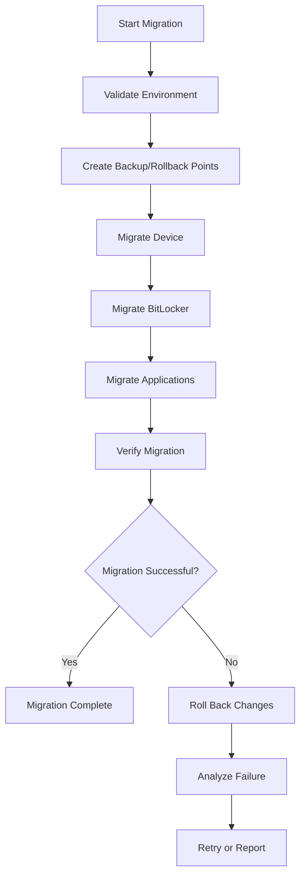
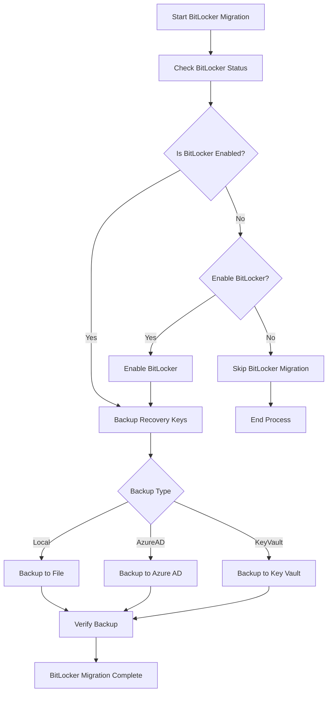
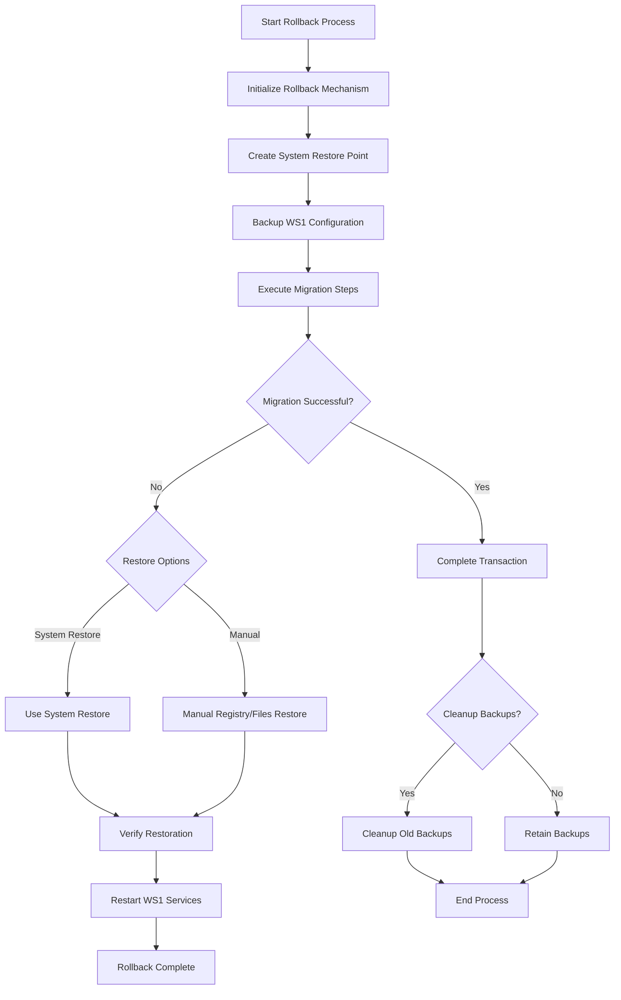
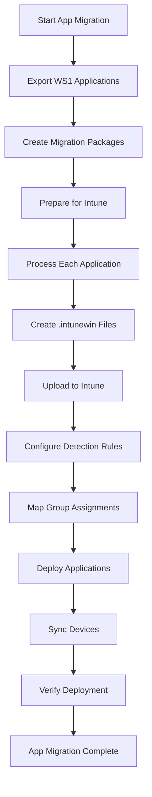
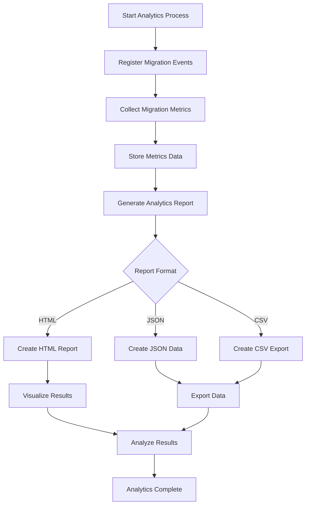

# Migration Toolkit Workflow Diagrams

This document provides visual workflow diagrams for the key processes in the Workspace ONE to Azure/Intune migration toolkit.

## Overview of Migration Process

## BitLocker Migration Workflow

## Rollback Mechanism Workflow

## Application Migration Workflow

## Analytics and Reporting Workflow

