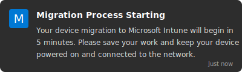
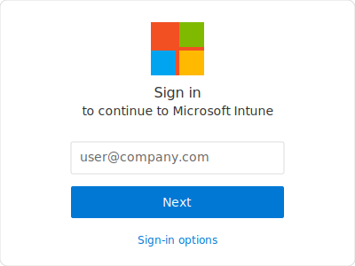
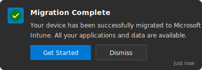

# Workspace ONE to Azure/Intune Migration Toolkit - How To Guide

This comprehensive guide covers the Workspace ONE to Azure/Intune Migration Toolkit from both technical and end-user perspectives. The toolkit provides an MVP (Minimum Viable Product) solution focused on essential migration functionality for enterprise environments.

## Table of Contents

- [For Technical SMEs](#for-technical-smes)
  - [System Requirements](#system-requirements)
  - [Architecture Overview](#architecture-overview)
  - [Installation and Setup](#installation-and-setup)
  - [Migration Process Workflow](#migration-process-workflow)
  - [Security Considerations](#security-considerations)
  - [Troubleshooting Guide](#troubleshooting-guide)
  - [Scaling and Performance](#scaling-and-performance)
- [For End Users](#for-end-users)
  - [What Is Changing](#what-is-changing)
  - [Preparation Checklist](#preparation-checklist)
  - [Migration Experience](#migration-experience)
  - [User Actions Required](#user-actions-required)
  - [After Migration](#after-migration)
  - [Frequently Asked Questions](#frequently-asked-questions)
  - [Getting Help](#getting-help)

---

# For Technical SMEs

This section is designed for Technical Subject Matter Experts (SMEs) responsible for implementing and supporting the Workspace ONE to Azure/Intune migration process.

## System Requirements

- **Operating System**: Windows 10 (Build 1809 or later) or Windows 11
- **PowerShell**: PowerShell 5.1 or later (PowerShell 7.x recommended for advanced features)
- **Account Privileges**: 
  - Standard user account for basic operations
  - Administrative access for certain operations (toolkit handles privilege elevation)
- **Network Connectivity**: 
  - Workspace ONE API endpoints
  - Azure/Microsoft Graph API endpoints
  - Microsoft Intune service endpoints
- **Storage**: Minimum 2GB free disk space for toolkit and logs

## Architecture Overview

The toolkit follows a modular architecture with these key components:

1. **Core Modules**:
   - `UserCommunicationFramework.psm1`: Manages all user notifications 
   - `RollbackMechanism.psm1`: Provides backup and recovery
   - `MigrationVerification.psm1`: Validates migration success
   - `SecurityFoundation.psm1`: Ensures secure operations
   - `EnhancedReporting.psm1`: Provides comprehensive reporting

2. **Entry Points**:
   - `Invoke-WorkspaceOneSetup.ps1`: Initial configuration
   - `Start-WS1AzureMigration.ps1`: Primary migration script
   - `Test-MigratedDevice.ps1`: Verification tool

## Installation and Setup

### Standard Installation

1. Clone or extract the toolkit to a local directory:
   ```powershell
   git clone https://github.com/your-org/ws1-to-azure-migration.git
   ```

2. Configure settings using the .env file (recommended):
   ```powershell
   # Copy the template file
   Copy-Item .env.template .env
   
   # Edit the .env file with your credentials
   notepad .env
   ```
   
   Your .env file should contain:
   ```
   # Azure Credentials
   AZURE_CLIENT_ID=your-client-id
   AZURE_CLIENT_SECRET=your-client-secret
   AZURE_TENANT_ID=your-tenant-id
   
   # Workspace ONE Credentials
   WS1_HOST=your-ws1-host
   WS1_USERNAME=your-ws1-username
   WS1_PASSWORD=your-ws1-password
   WS1_API_KEY=your-ws1-api-key
   ```

3. Run the initialization script:
   ```powershell
   .\src\scripts\Initialize-SecureEnvironment.ps1 -StandardAdminAccount "MigrationAdmin" -UseEnvFile
   ```

### Enterprise Deployment Options

#### Option 1: Azure Key Vault Integration

1. Create an Azure Key Vault with required secrets:
   - `WS1-ClientID`
   - `WS1-ClientSecret`
   - `AzureAD-ClientID`
   - `AzureAD-ClientSecret`
   - `MigrationAdmin-Username`
   - `MigrationAdmin-Password`

2. Initialize with Key Vault integration:
   ```powershell
   .\src\scripts\Initialize-SecureEnvironment.ps1 -KeyVaultName "WS1MigrationVault"
   ```

#### Option 2: Environment Variables

1. Copy the included template to create your `.env` file:
   ```powershell
   Copy-Item .env.template .env
   ```

2. Edit the `.env` file with your specific credentials:
   ```
   # Azure Credentials
   AZURE_CLIENT_ID=your-client-id
   AZURE_CLIENT_SECRET=your-client-secret
   AZURE_TENANT_ID=your-tenant-id
   
   # Workspace ONE Credentials
   WS1_HOST=your-ws1-host
   WS1_USERNAME=your-ws1-username
   WS1_PASSWORD=your-ws1-password
   WS1_API_KEY=your-ws1-api-key
   
   # Optional Configuration
   ADMIN_USERNAME=MigrationAdmin
   ADMIN_PASSWORD=SecurePassword123!
   ```

3. Initialize with environment variables:
   ```powershell
   .\src\scripts\Invoke-WorkspaceOneSetup.ps1 -UseEnvFile
   ```

## Pre-Migration Validation

Before beginning the migration process, validate your environment:

1. Verify script functionality:
   ```powershell
   .\src\scripts\TestScripts.ps1
   ```

2. Test environment readiness:
   ```powershell
   .\src\scripts\Test-WS1Environment.ps1 -GenerateReport
   ```

3. Test connectivity to required endpoints:
   ```powershell
   .\src\tools\Test-MigrationConnectivity.ps1
   ```

## Migration Process Workflow

The migration follows a five-stage process:

### Stage 1: Preparation
- Run `Start-WS1AzureMigration.ps1` to initiate the process
- System creates restore points and backups
- WS1 configuration is exported
- User receives initial notification

### Stage 2: WS1 Removal
- WS1 management components are uninstalled
- Local policies are adjusted
- System prepares for intermediate reboot

### Stage 3: Intermediate Processing
- System transitions to Azure/Intune management
- Prepares authentication components
- Configures device for Azure AD join

### Stage 4: Azure Enrollment
- Device joins Azure AD
- Intune enrollment completes
- User profiles are migrated

### Stage 5: Verification
- Validation checks are performed
- Reports are generated
- Notification of completion is sent

## Security Considerations

### Privilege Management

The toolkit uses three methods of privilege elevation:

1. **Just-in-time Elevation**: Creates temporary elevated tasks
2. **Temporary Admin Account**: Creates and removes accounts as needed
3. **Standard Admin Account**: Optional consistent admin identity (recommended for enterprise)

### Credential Handling

- No credentials are stored in plain text
- Azure Key Vault integration for enterprise deployments
- Environment variables for CI/CD scenarios
- Certificate-based encryption for local storage

## Logging and Monitoring

All activities are logged to multiple locations:

1. **Standard Logs**: `C:\Temp\Logs\WS1_Setup_[timestamp].log`
2. **Security Audit Logs**: `[LogPath]\SecurityAudit\[timestamp].log`
3. **Migration Logs**: `[LogPath]\Migration_[timestamp].log`
4. **Verification Reports**: `[LogPath]\VerificationReports\[timestamp].html`

## Troubleshooting Guide

### WS1 Component Removal Failures

If WS1 components fail to uninstall:

1. Check logs in `C:\Temp\Logs\` for specific errors
2. Attempt manual uninstallation of components
3. Run with `-EnrollmentOnly` flag to skip cleanup:
   ```powershell
   .\src\scripts\Invoke-WorkspaceOneSetup.ps1 -EnrollmentOnly
   ```

### Azure AD Join Failures

If Azure AD join fails:

1. Verify Azure credentials in settings
2. Check network connectivity to Azure endpoints
3. Verify device is not already Azure AD joined:
   ```powershell
   dsregcmd /status
   ```

### Migration Verification Failures

If verification reports issues:

1. Run manual verification:
   ```powershell
   .\src\scripts\Test-MigratedDevice.ps1 -GenerateReport
   ```
2. Check if required applications are installed
3. Review Intune enrollment status in Company Portal app

## Communication Features

The toolkit includes robust user communication features:

1. **Email Notifications**: Through the `Send-EmailNotification` function
   ```powershell
   Send-EmailNotification -EmailAddress "user@contoso.com" -Subject "Migration Complete" -Body "Device migration completed successfully"
   ```

2. **Migration Reports**: Generated via the `Send-MigrationReport` function
   ```powershell
   Send-MigrationReport -Recipients "admin@contoso.com" -Format "HTML" -ReportType "Technical"
   ```

3. **Custom Templates**: Stored in the `src/templates` directory

## Reporting Functions

The toolkit provides detailed reporting features:

1. **Migration Status Reports**: Real-time updates during migration
2. **Verification Reports**: Detailed post-migration validation
3. **Executive Reports**: High-level summaries for management
4. **Email Distribution**: Automatic report delivery to stakeholders

### Generating Executive Reports

```powershell
Import-Module .\src\modules\EnhancedReporting.psm1
Send-MigrationReport -Recipients "management@company.com" -Format "HTML" -ReportType "Executive"
```

## Rollback Procedures

If migration fails, the toolkit provides rollback capabilities:

1. **Manual Rollback**:
   ```powershell
   Import-Module .\src\modules\RollbackMechanism.psm1
   Rollback-Migration -Reason "Migration failed during Stage 3"
   ```

2. **Automatic Rollback**: Occurs when critical errors are detected during migration

3. **System Restore**: Windows restore points can be used as a last resort

## Scaling and Performance

For enterprise-wide deployment:

1. **SCCM/Intune Deployment**:
   - Package the toolkit as an application in SCCM or Intune
   - Use `.\deployment\Deploy-WS1EnrollmentTools.ps1 -ConfigSource "Pipeline"`

2. **Silent Mode Deployment**:
   ```powershell
   .\src\scripts\Start-WS1AzureMigration.ps1 -SilentMode -UserEmail "user@company.com"
   ```

3. **Batched Deployment**: Use task sequences to deploy in phases

### Performance Optimization

For large-scale deployments:

1. **Resource Throttling**: Configure in `settings.json`:
   ```json
   "performance": {
     "maxConcurrentOperations": 3,
     "apiThrottleLimit": 60
   }
   ```

2. **Proxy Cache**: For software downloads:
   ```json
   "network": {
     "useProxyCache": true,
     "proxyCacheUrl": "http://proxy.company.com:8080"
   }
   ```

## Testing Framework

The toolkit includes a comprehensive testing framework:

1. **Component Testing**: Via `Test-HighPriorityComponents.ps1`
2. **Security Testing**: Via `Test-SecurityFoundation.ps1`
3. **Integration Testing**: Via `Test-IntegrationCredentialSecurity.ps1`

## Command Reference

### Core Commands

- `Invoke-WorkspaceOneSetup.ps1`: Initial setup
- `Start-WS1AzureMigration.ps1`: Primary migration
- `Test-MigratedDevice.ps1`: Post-migration validation

### Reporting Commands

- `Send-MigrationReport`: Generate reports
- `Register-MigrationReportSchedule`: Schedule report generation

### Troubleshooting Commands

- `Test-WS1Environment.ps1`: Environment validation
- `Test-MigrationConnectivity.ps1`: Network connectivity testing
- `Test-RollbackMechanism.ps1`: Validate rollback functionality

---

# For End Users

This section will help you understand what to expect during the migration of your device from VMware Workspace ONE to Microsoft Azure/Intune.

## What Is Changing

Your device is transitioning from VMware Workspace ONE management to Microsoft Intune management. This change:

- Improves integration with Microsoft 365 services
- Enhances security features
- Streamlines access to corporate resources
- Enables better remote support options

## Preparation Checklist

Please complete these steps before your scheduled migration date:

- [ ] Save all open work and documents
- [ ] Close all applications
- [ ] Ensure your device is connected to power
- [ ] Connect to a reliable network (corporate network preferred)
- [ ] Verify you have at least 5GB of free disk space
- [ ] Back up any critical personal files to OneDrive or approved storage

## Migration Experience

### Migration Notification

You'll receive a notification before migration begins:



This notification will include:
- The scheduled migration time
- Estimated duration (typically 30-60 minutes)
- Contact information for support

### During Migration

1. **Initial Notification**: You'll see a message that migration is starting
2. **Lock Screen Updates**: Your lock screen will display migration progress
3. **Multiple Reboots**: Your device will restart several times automatically
4. **Progress Indicators**: Status updates will appear as notifications
5. **Temporary Limited Access**: During migration, some services may be temporarily unavailable

### Migration Stages

The migration proceeds through these stages:

#### Stage 1: Preparation (5-10 minutes)
- You'll receive a notification that migration is starting
- Please save your work and keep your device powered on
- Device will prepare for migration

#### Stage 2: Management Transition (10-15 minutes)
- Workspace ONE components will be removed
- Your device will restart
- Progress will be displayed on the lock screen

#### Stage 3: Azure AD Setup (10-15 minutes)
- Your device will join Microsoft Azure AD
- Microsoft Intune management will be configured
- Another restart may occur

#### Stage 4: Completion (5-10 minutes)
- Final configuration and validation
- You'll receive a notification that migration is complete
- You can then log in and resume normal work

## User Actions Required

In most cases, the migration will proceed automatically without requiring your intervention. However, there are a few points where you may need to take action:

### Possible Authentication Request

You may be prompted to sign in with your company credentials:



- Use your standard company email and password
- If Multi-Factor Authentication is enabled, be prepared to complete this step
- Contact support if you have trouble accessing your account

### Completion Notification

When migration is complete, you'll receive a notification:



- Click or tap "Get Started" to proceed
- Your device is now ready for normal use
- All your applications and files should be available

## After Migration

After migration completes, please verify:

1. You can log in with your company credentials
2. Your corporate applications are available
3. You can access company resources 
4. Your files and data are intact
5. The Microsoft Company Portal app is installed

## Frequently Asked Questions

### How long will the migration take?
The migration typically takes 30-60 minutes, depending on your device specifications and network speed.

### Will I lose any data during migration?
No, your data should remain intact. However, it's always a best practice to back up important files before any system change.

### What if I need to use my device during the scheduled migration time?
Please contact your IT department to reschedule the migration to a more convenient time.

### Will my applications need to be reinstalled?
No, your applications should remain installed and functional after migration.

### How will I know if the migration was successful?
You'll receive a completion notification, and you'll be able to log in normally.

### What is the Microsoft Company Portal app?
This app allows you to:
- Access company applications
- Verify your device compliance status
- Reset your company password
- Contact IT support

## Troubleshooting Common Issues

### Issue: Migration Appears Stuck

If progress seems halted for more than 30 minutes:

1. Check if the screen shows any error messages
2. Wait an additional 15 minutes (some stages take longer)
3. If no progress, contact IT support

### Issue: Cannot Log In After Migration

If you cannot log in after migration completes:

1. Ensure you're using your company email and password
2. Try restarting your device
3. Verify you're connected to the network
4. Contact IT support if login issues persist

### Issue: Missing Applications

If applications are missing after migration:

1. Open the Company Portal app
2. Check for available applications to install
3. Restart your device
4. Contact IT support if applications remain unavailable

## Getting Help

If you encounter any issues during or after migration, contact support through:

- **Email**: support@company.com
- **Phone**: 555-123-4567
- **Help Portal**: https://support.company.com
- **Teams**: IT Support Channel

When requesting help, please provide:
- Your device name (found in System settings)
- Your username
- Description of the issue
- Any error messages
- Screenshots if possible

## Post-Migration Benefits

After migration is complete, you'll enjoy several benefits:

- **Single Sign-On**: Simplified access to Microsoft services
- **Enhanced Security**: Better protection for company data
- **Improved Support**: Easier remote assistance from IT
- **Self-Service Portal**: Access to Company Portal for apps and support
- **Simplified Updates**: More reliable software updates

Thank you for your cooperation during this important upgrade to your device management system! 

---

## Legal Information

### Copyright

© 2025 Crayon. All Rights Reserved.

### Data Loss Disclaimer

**IMPORTANT**: Migrations between management systems involve inherent risks. Crayon specifically disclaims any responsibility for data loss, system instability, or service interruptions that may occur during or after the migration process. Users must maintain complete backups prior to migration.

This software is provided under a fair use license for Crayon customers and authorized partners. See [LICENSE.md](LICENSE.md) for complete terms and conditions. 